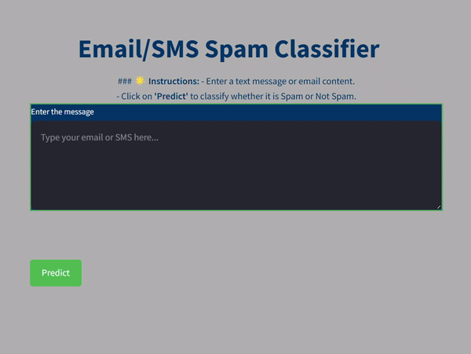
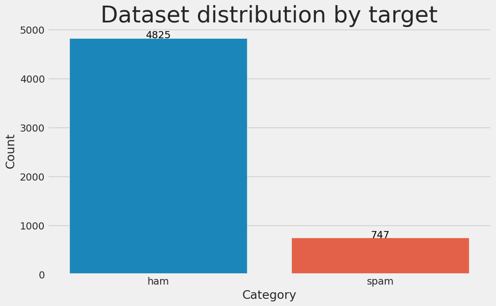
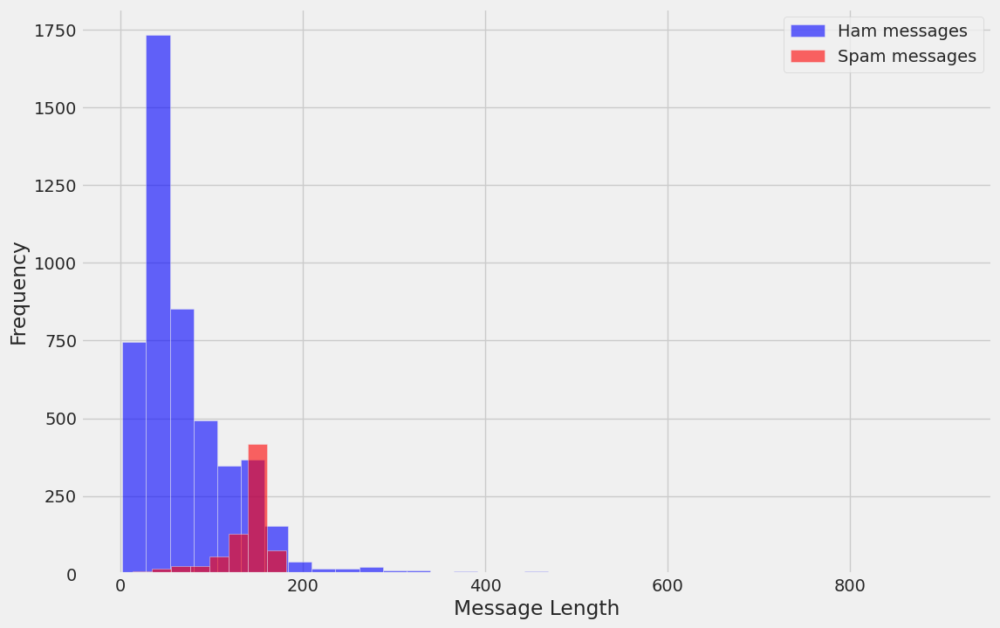
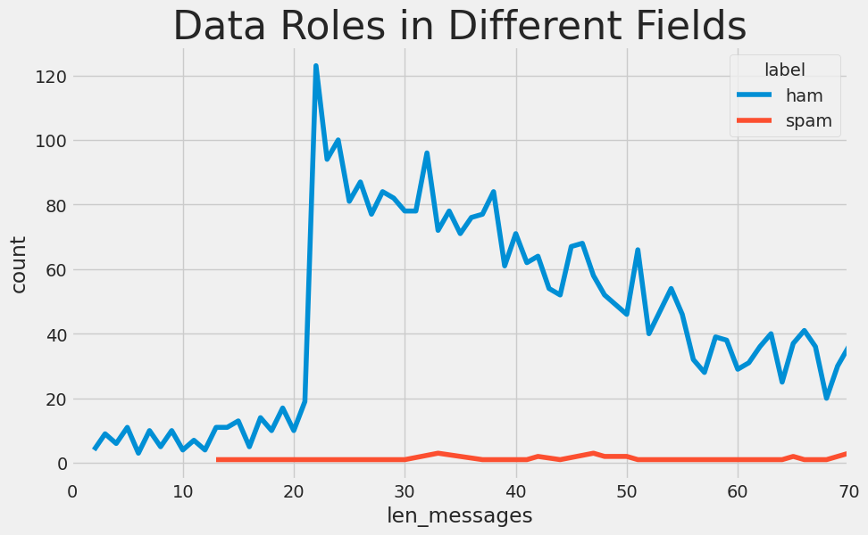
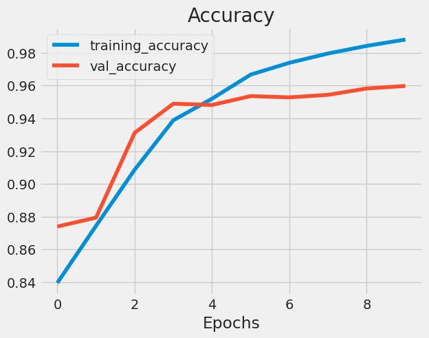
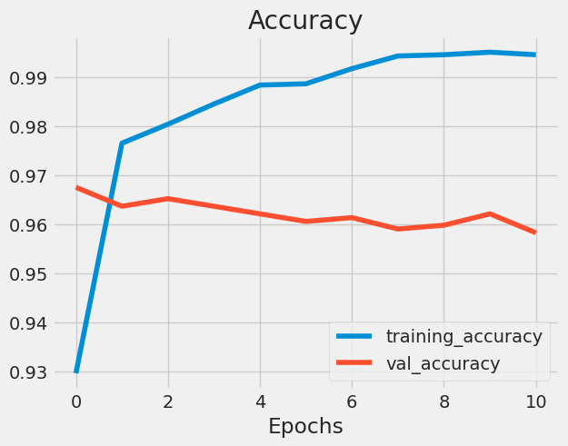

# SMS Spam Classification and Analysis
Predict whether emails or SMS messages are spam or not.

## Project Description

In today's digital world, spam messages can overwhelm our inboxes. To address this issue, I've developed a web application that classifies whether SMS or email messages are spam or not. This tool can help individuals and organizations efficiently filter unwanted messages.

- My Notebook at Kaggle:
    https://www.kaggle.com/code/abdelmoneimrehab/best-beginning-master-nlp-with-use-baseline-mode

## Project Contents

1. Exploratory Data Analysis
2. Data Cleaning 
3. Data Preprocessing using NLP
4. Baseline models for classifying SMS data
5. Deep Learning models for classifying SMS data
6. Model Deployment

## Resources Used
- **Packages** : Pandas, Numpy, Matplotlib, Tensorflow, Scikit-Learn, Keras, Nltk, Streamlit, etc.
- **Dataset**  : [SMS Spam Collection Dataset](https://www.kaggle.com/datasets/uciml/sms-spam-collection-dataset)
- **Word Embeddings** : GloVe embeddings and Universal Sentence Encoder (USE)

## 1. Exploratory Data Analysis

- **Visualizing Target Variable of the Dataset**

  

- **Visualizing Lengths of Messages**

  

  

## 2. Data Cleaning

### To ensure the text data is clean and ready for modeling, we applied the following preprocessing steps:

1. **Removing URLs**: All web links were extracted and removed to eliminate irrelevant information.
2. **Stripping HTML Tags**: Any HTML tags present in the text were removed to retain only plain text.
3. **Removing Emojis**: Emojis were filtered out to focus on textual content without visual symbols.
4. **Eliminating Punctuation**: All punctuation marks were stripped to standardize the text format for analysis.

## 3. Data Preprocessing using NLP

### In preparation for model training, we performed several key preprocessing steps:

- **Tokenization**: The text was tokenized into individual words to facilitate further processing.
- **Embeddings**: We used GloVe embeddings for the initial baseline model and applied TensorFlow's embedding layer for additional experiments.
- **Pretrained Model**: Finally, we applied embeddings from the Universal Sentence Encoder (USE) to enhance model performance.

## 4. Baseline Models for Classifying SMS Data

We implemented several baseline models to classify the SMS messages, including:

1. **Support Vector Classifier (SVC)**
2. **K-Neighbors Classifier (KNC)**
3. **Multinomial Naive Bayes (MNB)**
4. **Gaussian Naive Bayes (GNB)**
5. **Bernoulli Naive Bayes (BNB)**
6. **Decision Tree Classifier (DTC)**
7. **Logistic Regression Classifier (LRC)**
8. **Random Forest Classifier (RFC)**
9. **AdaBoost Classifier (ABC)**
10. **Bagging Classifier (BC)**
11. **Extra Trees Classifier (ETC)**
12. **Gradient Boosting Classifier (GBDT)**
13. **XGBoost Classifier (XGB)**

After evaluating the models, we applied voting and stacking methods to identify the best model for further experimentation.

## 5. Deep Learning Approaches for Classifying SMS Data

### Implemented models:

- **Simple Dense Layer**
- **LSTM Model**
- **Universal Sentence Encoder (USE)**

## 6. Model Deployment

The Multinomial Naive Bayes model, which yielded the highest accuracy, is used for production. A simple web application was developed using Streamlit to enable users to classify messages as spam or not in real time.

# Scope for Improvement

- Using larger datasets that encompass a wider variety of SMS messages.
- Experimenting with more powerful pretrained models, although they require significant computational resources.
- Implementing various techniques to enhance model accuracy, such as k-fold cross-validation and advanced data preprocessing techniques.

# Conclusion

The data analysis and modeling have been successfully conducted.

Please do ⭐ the repository if it has helped you in any way.
